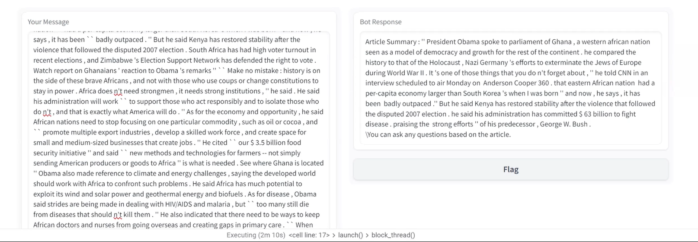
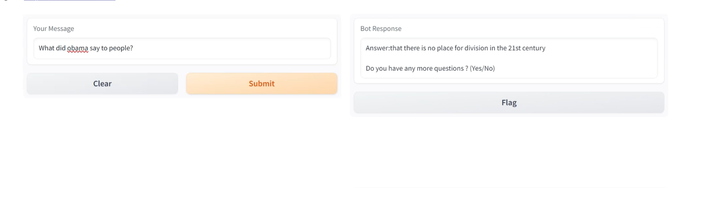
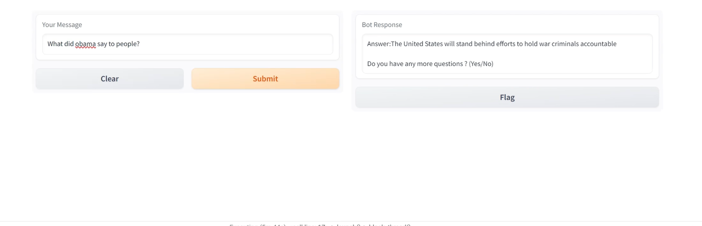

# NEWS-WISE

End-to-end news chatbot combining a fine-tuned T5 summarizer and a QLoRA fine-tuned Llama 2 7B for context-aware Q&A, served through a Gradio UI.

    

---

## Demo

**Summarizing a news article**



**Answering questions based on the article**




---

## How it works

1. Paste a news article into the chatbot
2. T5 generates a summary
3. Ask questions — Llama 2 answers them using the full article as context
4. Ask follow-up questions or input a new article to start over

---

## Models

| Model | Task | Trained on | Link |
|---|---|---|---|
| T5-small | Summarization | CNN/DailyMail (300K articles) | [ApurvaKolhe/text_summarization_t5](https://huggingface.co/ApurvaKolhe/text_summarization_t5) |
| Llama 2 7B | Question Answering | NewsQA by Microsoft Research (2,500 pairs) | [ApurvaKolhe/newsQA](https://huggingface.co/ApurvaKolhe/newsQA) |

---

## Results

**T5 Summarizer**

| | Before fine-tuning | After fine-tuning |
|---|---|---|
| Accuracy | 37.6% | 67.64% |
| Loss | 8.90 | 4.90 |

**Llama 2 Q&A** (evaluated on 101 test samples)

| Metric | Score |
|---|---|
| ROUGE-1 | 0.495 |
| ROUGE-2 | 0.262 |
| ROUGE-L | 0.489 |
| BLEU | 0.129 |
| BERT Cosine Similarity | 0.598 |

The BLEU score is low by design — the model paraphrases answers rather than copying the reference text word for word. The cosine similarity (0.598) is the more meaningful metric here, showing the answers are semantically aligned with the expected ones.

---

## Training setup

**T5** — fine-tuned using TensorFlow on a 300 article subset of CNN/DailyMail. Learning rate 2e-5, batch size 16. Evaluated using RougeL.

**Llama 2** — fine-tuned using QLoRA (4-bit quantization) via HuggingFace AutoTrain on Google Colab A100. Trained on 2,500 NewsQA pairs for 1 epoch. LoRA applied to `q_proj` and `v_proj` with rank 16.

---

## Running the chatbot

Open [Final_Chatbot.ipynb](Final_Chatbot.ipynb) in Google Colab and run cells top to bottom. Models load from HuggingFace automatically — no manual downloads needed.

```
Runtime: GPU (T4 or better)
```

> Llama 2 7B requires a GPU. CPU inference is not practical.

---

## Replicating the training

### T5 Summarizer
Open [T5_Summarization_Model_Evaluation.ipynb](T5_Summarization_Model_Evaluation.ipynb) in Colab.

```bash
pip install transformers==4.20.0 datasets huggingface-hub nltk rouge-score
```

Dataset loads automatically via HuggingFace `datasets` library (CNN/DailyMail).

### Llama 2 Q&A

Dataset preparation (run locally):
```bash
pip install pandas
python Dataset_For_QA_Chatbot/generate_data.py   # formats NewsQA into instruction prompts
python Dataset_For_QA_Chatbot/clean_text.py       # removes Penn Treebank artifacts
python Dataset_For_QA_Chatbot/trim_test_101.py    # strips answers from test split
```

Then open [Llama2_Model.ipynb](Llama2_Model.ipynb) in Colab for fine-tuning via AutoTrain:
```bash
pip install autotrain-advanced huggingface_hub
```

Upload your prepared dataset to HuggingFace and follow the AutoTrain setup in the notebook.

---

## Limitations

- Only 2,500 training samples were used due to compute constraints — a larger dataset would improve Q&A accuracy
- Articles longer than 512 tokens are chunked, so very long articles may lose some context between chunks
- Answers vary for the same question since the model is generative — this is expected, not a bug
- No memory between sessions — each new article starts fresh
- Single-user only — the chatbot state is not thread-safe for concurrent users

---
